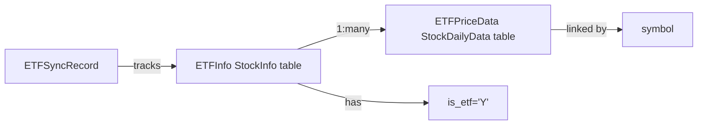

# Data Model: ETF Data Synchronization

**Feature**: 001-etf-sync  
**Date**: 2025-01-27  
**Status**: Design Complete

## Overview

本文档定义ETF数据同步功能的数据模型，包括实体、关系、验证规则和状态转换。

## Entity Definitions

### 1. ETF Instrument Entity

**Name**: `ETFInfo` (基于 `StockInfo` 模型)

**Description**: ETF基础信息实体，扩展自股票信息实体

**Fields**:

| Field Name | Type | Constraints | Description |
|------------|------|-------------|-------------|
| symbol | String(20) | PK, Not Null | ETF代码（含市场前缀，如 SH.510050） |
| stock_name | String(100) | Not Null | ETF名称 |
| stock_code | String(10) | Not Null | ETF代码（不含市场前缀） |
| market_code | String(10) | Not Null | 市场代码（SH/SZ） |
| **is_etf** | **String(1)** | **Default='Y', Not Null** | **是否为ETF标记 (Y/N)** |
| stock_type | String(20) | Nullable | 证券类型（如：股票型ETF、债券型ETF） |
| industry | String(100) | Nullable | 所属行业 |
| sector | String(100) | Nullable | 所属板块 |
| list_date | DateTime | Nullable | 上市日期 |
| delist_date | DateTime | Nullable | 退市日期 |
| is_active | String(1) | Default='Y', Not Null | 是否活跃 |
| last_sync_date | DateTime | Nullable | 最后同步日期 |
| first_fetch_time | DateTime | Nullable | 首次获取时间 |
| created_at | DateTime | Not Null | 记录创建时间 |
| updated_at | DateTime | Not Null | 记录更新时间 |

**Validation Rules**:
- `is_etf` 必须为 'Y' 或 'N'
- `symbol` 格式必须是 `{MARKET}.{CODE}`（如 SH.510050, SZ.159001）
- `market_code` 必须是 'SH' 或 'SZ'
- 当 `is_etf='Y'` 时，ETF必须关联到相应交易所

**Indexes**:
```sql
CREATE INDEX idx_is_etf ON stock_info(is_etf);
CREATE INDEX idx_etf_market_code ON stock_info(market_code, is_etf) WHERE is_etf='Y';
```

### 2. ETF Price Data Entity

**Name**: `ETFPriceData` (复用 `StockDailyData` 模型)

**Description**: ETF历史价格数据，与股票价格数据共享表结构

**Fields**: (与股票价格表完全相同)

| Field Name | Type | Constraints | Description |
|------------|------|-------------|-------------|
| trade_date | DateTime | PK, Not Null | 交易日期 |
| symbol | String(20) | PK, Not Null | ETF代码 |
| stock_name | String(100) | Not Null | ETF名称 |
| close_price | DECIMAL(10,4) | Not Null | 收盘价 |
| open_price | DECIMAL(10,4) | Nullable | 开盘价 |
| high_price | DECIMAL(10,4) | Nullable | 最高价 |
| low_price | DECIMAL(10,4) | Nullable | 最低价 |
| volume | BigInteger | Default=0 | 成交量（手） |
| turnover | DECIMAL(20,2) | Default=0 | 成交额（元） |
| price_change | DECIMAL(10,4) | Nullable | 涨跌额 |
| price_change_pct | DECIMAL(8,4) | Nullable | 涨跌幅（%） |
| premium_rate | DECIMAL(8,4) | Nullable | 溢价率（基金特有） |
| market_code | String(10) | Not Null | 市场代码 |
| created_at | DateTime | Not Null | 记录创建时间 |
| updated_at | DateTime | Not Null | 记录更新时间 |

**Validation Rules**:
- ETF价格数据通过关联的ETF信息中的 `is_etf='Y'` 标识
- 价格字段必须为非负值
- 成交量必须为非负整数
- `trade_date` 必须是有效交易日

**Relationships**:
- `symbol` → `stock_info.symbol` (1:many，一个ETF有多个价格记录)

### 3. ETF Sync Record Entity

**Name**: `ETFSyncRecord` (可选，用于追踪同步状态)

**Description**: ETF同步记录，用于追踪同步历史和状态

**Fields**:

| Field Name | Type | Constraints | Description |
|------------|------|-------------|-------------|
| sync_id | UUID | PK | 同步记录ID |
| exchange_code | String(10) | Not Null | 交易所代码 |
| sync_type | String(20) | Not Null | 同步类型（list/prices） |
| total_etfs | Integer | Default=0 | ETF总数 |
| successful_count | Integer | Default=0 | 成功数量 |
| failed_count | Integer | Default=0 | 失败数量 |
| start_time | DateTime | Not Null | 开始时间 |
| end_time | DateTime | Nullable | 结束时间 |
| status | String(20) | Not Null | 状态（running/completed/failed） |
| error_message | String(500) | Nullable | 错误信息 |
| created_at | DateTime | Not Null | 记录创建时间 |

## Entity Relationships



### Relationships

1. **ETFInfo → ETFPriceData**: 一对多
   - 一个ETF有多个历史价格记录
   - 通过 `symbol` 字段关联
   - 通过 `is_etf='Y'` 标识为ETF数据

2. **ETFInfo → Market**: 多对一
   - 多个ETF属于同一市场（SH/SZ）
   - 通过 `market_code` 和 `is_etf` 联合标识

3. **ETFSyncRecord → ETFInfo**: 一对多
   - 一个同步记录对应多个ETF
   - 用于追踪同步状态

## State Transitions

### ETF Sync Flow

```
┌─────────────────┐
│   Start Sync    │
└────────┬────────┘
         │
         v
┌─────────────────┐      ┌─────────────────┐
│ Fetch ETF List  │─────▶│  Store ETF Info│
│ from API        │      │  (is_etf='Y')   │
└────────┬────────┘      └────────┬────────┘
         │                         │
         v                         v
┌─────────────────┐      ┌─────────────────┐
│Fetch ETF Prices │─────▶│ Store Price     │
│from API         │      │ Data            │
└────────┬────────┘      └────────┬────────┘
         │                         │
         v                         v
┌─────────────────┐      ┌─────────────────┐
│  Complete       │─────▶│  ETF Available  │
│  Sync           │      │  for Query      │
└─────────────────┘      └─────────────────┘
```

### ETF Status States

1. **NEW**: ETF已添加到数据库，`is_etf='Y'`，未同步价格
2. **SYNCING**: 正在同步ETF价格数据
3. **ACTIVE**: ETF信息完整，价格数据已同步
4. **ERROR**: 同步过程中出现错误

状态通过以下字段标识：
- `is_active='Y'` → ETF处于活跃状态
- `last_sync_date IS NOT NULL` → ETF价格已同步
- `is_etf='Y'` → ETF标识

## Validation Rules Summary

### ETF List Sync Validation

1. ETF代码格式验证：
   - 上海ETF: `SH.{6位数字}`
   - 深圳ETF: `SZ.{6位数字}`
   - 验证是否以 `5` 或 `1` 开头（ETF代码特征）

2. ETF名称验证：
   - 必须包含 "ETF" 或 "基金" 关键词
   - 长度在 2-100 字符之间

3. 交易所验证：
   - `market_code` 必须是 'SH' 或 'SZ'
   - ETF列表API必须匹配对应的交易所

### ETF Price Data Validation

1. 价格数据验证：
   - `close_price` > 0
   - `high_price` >= `low_price`
   - `open_price` 必须存在于当天交易范围内

2. 交易量验证：
   - `volume` >= 0
   - `turnover` >= 0

3. 日期验证：
   - `trade_date` 必须是有效交易日
   - 不能是未来日期

## Database Schema Changes

### Migration Script

```sql
-- Step 1: Add is_etf column
ALTER TABLE stock_info 
ADD COLUMN is_etf VARCHAR(1) NOT NULL DEFAULT 'N';

-- Step 2: Add comment
COMMENT ON COLUMN stock_info.is_etf IS '是否为ETF标记 (Y/N)';

-- Step 3: Create index for ETF queries
CREATE INDEX idx_stock_info_is_etf ON stock_info(is_etf);

-- Step 4: Create composite index for ETF by market
CREATE INDEX idx_stock_info_etf_market 
ON stock_info(market_code, is_etf) 
WHERE is_etf = 'Y';

-- Step 5: Update existing records (ensure all stocks are marked as NOT ETF)
UPDATE stock_info SET is_etf = 'N' WHERE is_etf IS NULL OR is_etf = '';
```

### Rollback Script

```sql
-- Remove indexes first
DROP INDEX IF EXISTS idx_stock_info_is_etf;
DROP INDEX IF EXISTS idx_stock_info_etf_market;

-- Remove column
ALTER TABLE stock_info DROP COLUMN IF EXISTS is_etf;
```

## Data Integrity Constraints

1. **Referential Integrity**: 
   - ETF价格数据的 `symbol` 必须存在于 `stock_info` 表
   - 且对应的 `is_etf='Y'`

2. **Uniqueness**:
   - `symbol` 在 `stock_info` 表中唯一
   - `(trade_date, symbol)` 在 `stock_daily_data` 表中唯一

3. **Check Constraints**:
   - `is_etf IN ('Y', 'N')`
   - `is_active IN ('Y', 'N')`
   - ETF价格数据必须关联到 `is_etf='Y'` 的记录

## Query Patterns

### Common Queries

1. **Get all ETFs**:
```sql
SELECT * FROM stock_info WHERE is_etf = 'Y' AND is_active = 'Y';
```

2. **Get ETFs by market**:
```sql
SELECT * FROM stock_info 
WHERE is_etf = 'Y' AND market_code = 'SH' AND is_active = 'Y';
```

3. **Get ETF price history**:
```sql
SELECT sd.* 
FROM stock_daily_data sd
JOIN stock_info si ON sd.symbol = si.symbol
WHERE si.is_etf = 'Y' AND sd.symbol = 'SH.510050'
ORDER BY sd.trade_date DESC;
```

4. **Get ETF count by market**:
```sql
SELECT market_code, COUNT(*) as etf_count
FROM stock_info
WHERE is_etf = 'Y' AND is_active = 'Y'
GROUP BY market_code;
```

## Performance Considerations

1. **Indexes**: 
   - `idx_stock_info_is_etf`: 加速ETF查询
   - `idx_stock_info_etf_market`: 优化按市场查询ETF

2. **Partitioning**:
   - `stock_daily_data` 表使用TimescaleDB时序分区
   - ETF价格数据与股票数据共享分区策略

3. **Query Optimization**:
   - 使用覆盖索引减少回表查询
   - 利用TimescaleDB的压缩减少存储空间

## Conclusion

数据模型设计遵循以下原则：
- ✅ 最大化复用现有schema
- ✅ 最小化schema变更
- ✅ 保持数据完整性
- ✅ 优化查询性能
- ✅ 支持ETF特有查询需求
